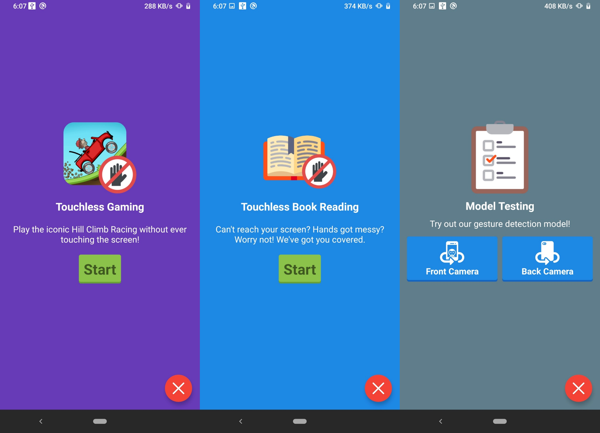
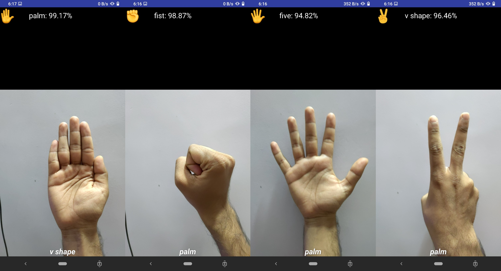

# HanGest

This application demonstrates the capability of the model.
 1. It can be used to play real-time games.
 2. It can be used to navigate interfaces.

**Video demonstration:** https://www.youtube.com/watch?v=4AmNNpHttQI

*Application welcome screens:*

*Demonstrating the accuracy of the model:*

